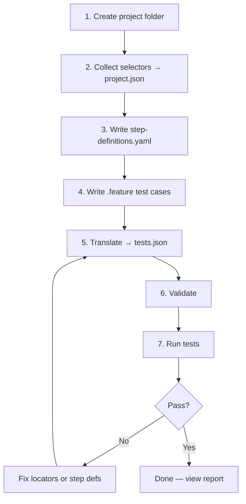

# Build Automation From Scratch

A practical guide for **PM**, **BA**, and **developers** who want to create browser tests without being a dedicated QA engineer.

You write tests in plain English (Gherkin). AI can help generate the technical files. This framework connects everything and runs Playwright for you.

---

## Who is this for?

| Role | What you do | What you do **not** need |
|------|-------------|--------------------------|
| **PM / BA** | Describe user flows, acceptance criteria, what to verify | CSS, XPath, Playwright code |
| **Developer** | Set up project, review locators, run tests in CI | Hand-write every JSON test file |
| **Anyone** | Use AI prompts below to speed up setup | Manual copy-paste of selectors into test cases |

**Goal:** One person (with AI help) can go from a website URL to passing automated tests.

---

## The 5-minute mental model

```
┌──────────────┐   ┌─────────────────────┐   ┌─────────────┐   ┌────────────┐
│  .feature    │   │ step-definitions    │   │ project.json│   │ tests.json │
│  (what to    │ + │ .yaml               │ + │ (selectors) │ → │ (generated)│
│   test)      │   │ (how to automate)   │   │             │   │            │
└──────────────┘   └─────────────────────┘   └─────────────┘   └────────────┘
       ↑                      ↑                       ↑
   You / AI              You / AI                 You / AI
```

| File | Written by | Contains |
|------|------------|----------|
| `*.feature` | PM, BA, Dev, or AI | Human-readable scenarios (`Given` / `When` / `Then`) |
| `step-definitions.yaml` | Dev or AI | Maps each Gherkin phrase → click, navigate, assert |
| `project.json` | Dev or AI | Real selectors (`css`, `role`, `text`, …) |
| `tests.json` | **Auto** (translate) | Machine format for Playwright — never edit by hand |

**Translate does not discover selectors.** It only converts Gherkin → JSON using rules you already defined.

---

## End-to-end workflow



### Commands (copy-paste)

```bash
npm install
npm run playwright:install

# After files are ready:
npm run validate -- --project <project-name>
npm run translate -- --project <project-name> --page <page-name>
npm run test -- --project <project-name> --page <page-name>
npm run report -- --project <project-name>
```

**Web UI:** `npm run dev` → **Build** tab (step-by-step + AI prompts) or **Translate** tab (Gherkin → JSON)

### Two prompt modes in the Build wizard

| Mode | When to use | What you provide |
|------|-------------|------------------|
| **AI discovers** (default) | You only have a URL — don't know selectors or Gherkin | Website URL + page name |
| **Guided** | You have HTML, codegen output, or a phrase list | Paste context into the form |

**AI discovers** prompts tell the AI to visit the site, inspect elements, and generate locators / step-definitions / feature files by itself. Best in **Cursor** with browser tools enabled.

---

## Step 0 — Create a new project (manual, ~5 min)

Create a new project folder — copy **only the config templates**, not the whole demo tree:

```bash
mkdir -p projects/my-site/pages
cp projects/coty/project.json projects/my-site/
cp projects/coty/step-definitions.yaml projects/my-site/
```

**Do not** run `cp -r projects/coty projects/my-site` — that can create a nested `projects/my-site/coty/` folder that the runner ignores.

Correct layout:

```
projects/my-site/
  project.json
  step-definitions.yaml
  pages/
    home/home.feature
    footer/footer.feature
```

**Forbidden:** `projects/my-site/coty/`, `projects/coty/my-site/`, or `pages/all-page/all-page.feature`.

Edit `projects/my-site/project.json`:

```json
{
  "name": "my-site",
  "type": "web",
  "environment": "staging",
  "run": {
    "baseUrl": "https://example.com",
    "browser": "chromium",
    "headless": true,
    "timeout": 45000,
    "retries": 1,
    "viewport": { "width": 1280, "height": 720 },
    "screenshot": "only-on-failure",
    "trace": "on-first-retry"
  },
  "variables": {},
  "locators": []
}
```

Create your first page folder:

```
projects/my-site/
  project.json
  step-definitions.yaml      # start empty or copy from coty
  pages/
    homepage/
      homepage.feature       # you will create this
      tests.json             # appears after translate
```

---

## Step 1 — Collect selectors (AI-assisted)

### Don't know selectors? Use **AI discovers**

In the Build wizard → **Collect selectors** → choose **AI discovers**. Enter only the website URL. The prompt tells AI to open the site and output a `project.json` locators array. No HTML paste required.

### What you need

Every **click**, **fill**, or **targeted assertion** needs a locator in `project.json`.

### Locator format

```json
{
  "id": "login-button",
  "strategy": "role",
  "value": "button[name='Sign in']",
  "page": "login"
}
```

### Supported strategies (prefer top to bottom)

| Strategy | Use when | Example `value` |
|----------|----------|-----------------|
| `role` | Button, link, heading with accessible name | `link[name='Contact Us']` |
| `label` | Form field with label | `Email address` |
| `testid` | Element has `data-testid` | `submit-btn` |
| `text` | Unique visible text | `WE ARE COTY` |
| `css` | Scoped selector when role/text is ambiguous | `footer a[href='/contact-us']` |
| `xpath` | Last resort | `//button[@type='submit']` |

### Non-AI option: Playwright Codegen

```bash
npx playwright codegen https://example.com
```

Click elements → copy `getByRole` / `getByLabel` → convert to `project.json` format.

---

### AI Prompt 1 — Generate locators for `project.json`

Copy this prompt into Cursor, ChatGPT, or Claude. Attach a screenshot, HTML snippet, or codegen output.

```
You are helping me build browser test automation for this framework.

Target website: https://example.com
Page area to cover: [e.g. homepage header, footer, login form]

Output ONLY a JSON array of locators to append to project.json "locators".
Do NOT output CSS in feature files or step definitions — only here.

Rules:
- Each locator needs: id, strategy, value, page
- id: kebab-case, descriptive (e.g. nav-contact-link, hero-heading)
- Prefer strategy order: role → label → testid → text → css → xpath
- Use css only when role/text matches multiple elements (e.g. desktop vs mobile nav)
- Scope css selectors (e.g. "footer a[...]", "nav [role=menubar] a[...]")
- For role strategy, value format: role[name='Visible Name'] e.g. link[name='Our Brands']
- List every interactive element I will need: nav links, footer links, buttons, form fields, cookie banner, mobile menu

Example output:
[
  {
    "id": "hero-heading",
    "strategy": "text",
    "value": "Welcome",
    "page": "homepage"
  },
  {
    "id": "footer-contact",
    "strategy": "css",
    "value": "footer a[href='/contact-us']",
    "page": "footer"
  }
]

Here is context about the page:
[Paste HTML, codegen output, or describe elements you see]
```

**After AI responds:** Merge the array into `projects/<name>/project.json` → `locators`. Remove duplicates.

---

## Step 2 — Write step definitions (AI-assisted)

### **AI discovers** mode

After locators are in `project.json`, use **AI discovers** on the Step definitions step. The wizard pre-fills your locators from the project. The prompt tells AI to invent Gherkin phrases and write the full `step-definitions.yaml`.

`step-definitions.yaml` connects Gherkin phrases to actions. **Every phrase in your `.feature` file must exist here** (exact match or parameterized pattern).

### File structure

```yaml
steps:
  "user is on home page":
    - action: navigate
      value: "{{baseUrl}}"
    - action: wait
      value: "2000"
    - action: dismiss_cookies

  "user clicks contact link in footer":
    - action: click
      target: footer-contact
    - action: wait
      value: "2000"

assertions:
  'I should see text "{text}"':
    - type: text
      expected: "{text}"

  'the page URL should contain "{fragment}"':
    - type: url
      expected: "{fragment}"

  "I should see contact link in footer":
    - type: visible
      target: footer-contact
```

### Available actions

`navigate`, `click`, `fill`, `select`, `check`, `uncheck`, `press`, `wait`, `hover`, `viewport`, `clear_storage`, `dismiss_cookies`, `screenshot`

### Available assertion types

`url`, `title`, `visible`, `hidden`, `text`, `attribute`, `count`, `enabled`, `disabled`, `value`

### Important rules

- Use `target: <locator-id>` for clicks and targeted assertions — **not** raw CSS
- Use `{{baseUrl}}` for URLs in navigate steps
- Parameterized phrases use `{param}` in the YAML key and `"{param}"` in Gherkin quotes
- Reuse shared phrases across pages (e.g. `'I should see text "{text}"'`) — define once

---

### AI Prompt 2 — Generate `step-definitions.yaml`

```
You are helping me write step-definitions.yaml for a Playwright JSON automation framework.

Project: [project name]
Base URL variable: {{baseUrl}}
Page: [e.g. footer]

I will paste:
1) Locator ids from project.json (below)
2) List of Gherkin phrases I want to support

Output valid YAML with two sections: steps and assertions.

Rules:
- steps: maps When/Given phrases → list of { action, target?, value? }
- assertions: maps Then/And phrases → list of { type, target?, expected? }
- click/fill/hover/check need target = locator id from my list (never raw CSS)
- navigate uses value: "{{baseUrl}}" or "{{baseUrl}}/path"
- Add action: wait value: "2000" after navigate and click
- Use dismiss_cookies after home page navigate (not for cookie-banner-only tests)
- For dynamic text use parameterized keys like 'I should see text "{text}"' with expected: "{text}"
- For URL checks use 'the page URL should contain "{fragment}"' with type: url
- For title use 'the page title should contain "{title}"' with type: title
- Phrase keys must match Gherkin text exactly (without Given/When/Then/And)

Locator ids available:
[Paste id list from project.json]

Phrases I need:
[Paste list, e.g.:
  - user is on Coty home page
  - user clicks footer contact link
  - the page URL should contain "contact-us"
  - I should see text "Contact Us"
]

Reference example from working project — follow this style:
[Paste relevant section from projects/coty/step-definitions.yaml]
```

**After AI responds:** Save to `projects/<name>/step-definitions.yaml`. Run validate:

```bash
npm run validate -- --project <name>
```

---

## Step 3 — Write test cases (AI-assisted)

### One `.feature` file per page (important)

**Do not put all scenarios in one file.** Use one folder per page area:

```
projects/supplier/pages/
  home/home.feature
  communications/communications.feature
  sustainability/sustainability.feature
  footer/footer.feature
  popups/popups.feature
```

In the Build wizard → **Test cases** step, choose **All pages — separate .feature per page folder**. The prompt tells AI to output each file with a `======== FILE: ... ========` header.

Translate **per page**:

```bash
npm run translate -- --project supplier --page home
npm run translate -- --project supplier --page communications
```

### **AI discovers** mode

Use **AI discovers** on the Test cases step. The wizard pre-fills `step-definitions.yaml` from your project. AI visits the site (or uses step defs) and writes `.feature` scenarios using **only** phrases already defined.

Test cases live in `.feature` files — **one file per page folder**. Write like a user story — no selectors.

### Format rules

```gherkin
@my-site @homepage @smoke
Feature: Homepage
  As a visitor
  I want to see the homepage
  So that I understand the product

  @TC-MYSITE-HP-001
  Scenario: Hero and title load
    Given user is on home page
    Then the page title should contain "Example"
    And I should see text "Welcome"
```

| Rule | Detail |
|------|--------|
| Tags | `@TC-...` on each scenario for traceability |
| Keywords | `Given`, `When`, `Then`, `And` — text after keyword must match `step-definitions.yaml` |
| Quotes | Use double quotes for dynamic values: `"Contact Us"` |
| No selectors | Never put CSS, `#id`, or XPath in feature files |

---

### AI Prompt 3 — Generate `.feature` test cases (per page)

Use the **Build wizard** → **Test cases** step. Every generate prompt now includes **per-page folder rules** (locators, step-definitions, and features).

**Important:** All three AI steps (locators, step-definitions, test cases) reference the same page folder list so test cases stay **one file per page**.

**Single page** → one file at `projects/<name>/pages/<page>/<page>.feature` (~8 scenarios).

**All pages** → AI outputs multiple blocks:

```
======== FILE: projects/supplier/pages/home/home.feature ========
@supplier @home @smoke
Feature: ...
======== END FILE ========

======== FILE: projects/supplier/pages/footer/footer.feature ========
...
======== END FILE ========
```

Rules for both modes:
- **~8 scenarios per page** (not 100 in one file)
- Tag feature: `@[project] @[page] @smoke`
- Tag scenarios: `@TC-[PROJECT]-[PAGE]-001` (restart numbering per file)
- ONLY phrases from `step-definitions.yaml`
- No selectors, Playwright, or JSON

Example page folders (supplier.coty.com):

```
home
communications
sustainability
terms-conditions
purchase-order
invoicing
support-contact
planning-and-rd
navigation
footer
popups
```

---

## Step 4 — Translate, validate, run

### Translate (Gherkin → JSON)

```bash
npm run translate -- --project my-site --page homepage
```

Or use the web UI: `npm run dev` → Translate.

**If translate fails** with `No step definition for: "..."`:
1. Copy the exact phrase from the error
2. Add it to `step-definitions.yaml` (or fix typo in `.feature`)
3. Re-run translate

### Validate (structure check)

```bash
npm run validate -- --project my-site
```

Checks: valid `project.json`, valid YAML, `tests.json` exists for each page.

### Run tests

```bash
npm run test -- --project my-site --page homepage
npm run report -- --project my-site
```

---

### AI Prompt 4 — Fix translate / validate errors

```
I am using a Gherkin → JSON test automation framework.

Translate failed with:
[Paste error message]

My feature file:
[Paste .feature content or failing scenario]

My step-definitions.yaml:
[Paste relevant section]

My project.json locators:
[Paste relevant locators]

Tell me:
1. Which phrase is missing or mismatched (exact spelling)
2. The YAML block to add to step-definitions.yaml
3. Any locator id missing from project.json
4. Do not suggest editing tests.json — it is auto-generated
```

---

### AI Prompt 5 — Fix failing Playwright tests

```
Playwright test failed. Help me fix locators or step definitions (not the .feature file unless the assertion text is wrong).

Project: [name]
Scenario: [name]
Error:
[Paste failure from terminal or HTML report]

Current locator in project.json:
[Paste locator entry]

Step definition:
[Paste from step-definitions.yaml]

Suggest:
1. Root cause (locator strict mode, timing, cookie banner, new tab, etc.)
2. Updated locator JSON entry (strategy + value)
3. Whether step-def needs wait/dismiss_cookies/viewport change
```

---

## Manual workflow (no AI)

Once you understand the flow, you can do everything by hand:

| Step | Action | File |
|------|--------|------|
| 1 | Set base URL and run config | `project.json` |
| 2 | Run `npx playwright codegen <url>`, collect elements | `project.json` → `locators` |
| 3 | For each Gherkin phrase, map to action/assert | `step-definitions.yaml` |
| 4 | Write scenarios in plain English | `pages/<page>/*.feature` |
| 5 | `npm run translate` | generates `tests.json` |
| 6 | `npm run validate` | fix any schema errors |
| 7 | `npm run test` | fix locators until green |
| 8 | `npm run report` | share results |

---

## Checklist before you run

- [ ] `project.json` has `run.baseUrl` and all needed `locators`
- [ ] Every Gherkin phrase in `.feature` exists in `step-definitions.yaml`
- [ ] Click steps use `target: <id>` where `<id>` exists in `project.json`
- [ ] `npm run translate` completes without errors
- [ ] `npm run validate` prints `All projects valid.`
- [ ] `npm run test` passes (or failures are real bugs, not bad locators)

---

## Common mistakes

| Mistake | Fix |
|---------|-----|
| Phrase typo between `.feature` and YAML | Text must match exactly (case-insensitive for non-parameterized) |
| Selector in `.feature` file | Move to `project.json`, use human phrase + `target` in YAML |
| Editing `tests.json` by hand | Re-run translate after any `.feature` or YAML change |
| Translate before step defs exist | Write YAML first, then translate |
| Same text matches 2 elements | Use scoped `css` in `project.json` (see coty nav/footer) |
| Cookie banner blocks clicks | Add `dismiss_cookies` to home-page step def (already in coty template) |

---

## Working example: `projects/coty/`

Study the demo against [coty.com](https://www.coty.com):

| File | Purpose |
|------|---------|
| `projects/coty/project.json` | 40+ locators, `baseUrl` |
| `projects/coty/step-definitions.yaml` | All phrase mappings |
| `projects/coty/pages/footer/footer.feature` | 12 footer scenarios |
| `projects/coty/pages/footer/tests.json` | Generated JSON |

```bash
npm run validate -- --project coty
npm run translate -- --project coty --page footer
npm run test -- --project coty --page footer
```

---

## Quick reference

| I want to… | Command or file |
|------------|-----------------|
| Start new project | `mkdir -p projects/my-site/pages` + copy `project.json` and `step-definitions.yaml` from `projects/coty/` |
| Find selectors | `npx playwright codegen <url>` or **AI Prompt 1** |
| Map Gherkin to actions | `step-definitions.yaml` or **AI Prompt 2** |
| Write test scenarios | `*.feature` or **AI Prompt 3** |
| Generate JSON | `npm run translate -- --project <name>` |
| Check structure | `npm run validate -- --project <name>` |
| Run tests | `npm run test -- --project <name>` |
| View report | `npm run report -- --project <name>` |
| Web UI | `npm run dev` |

---

## See also

- [locators-and-test-cases.md](./locators-and-test-cases.md) — selector strategies and complex forms
- [README](../README.md) — install and CLI
- `projects/coty/STEPS-REFERENCE.md` — phrase inventory for the demo site
